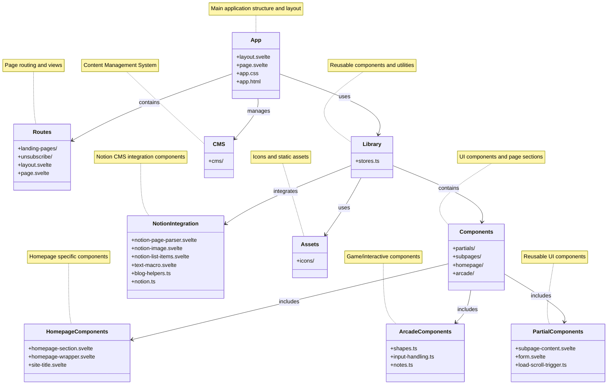
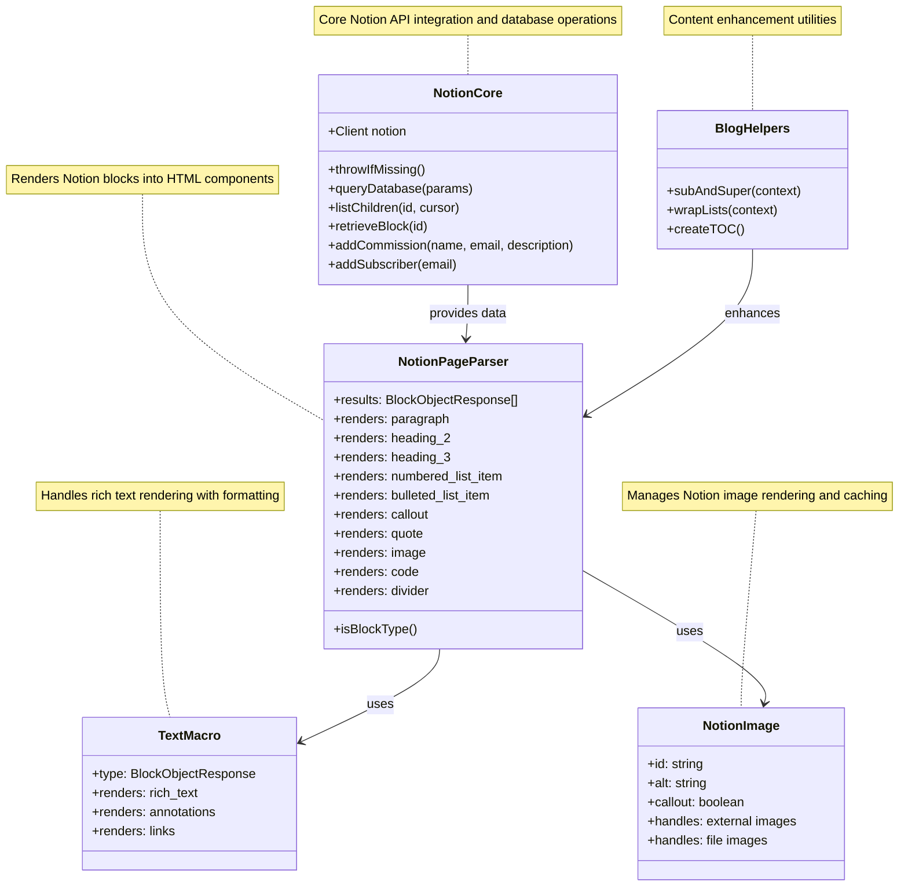
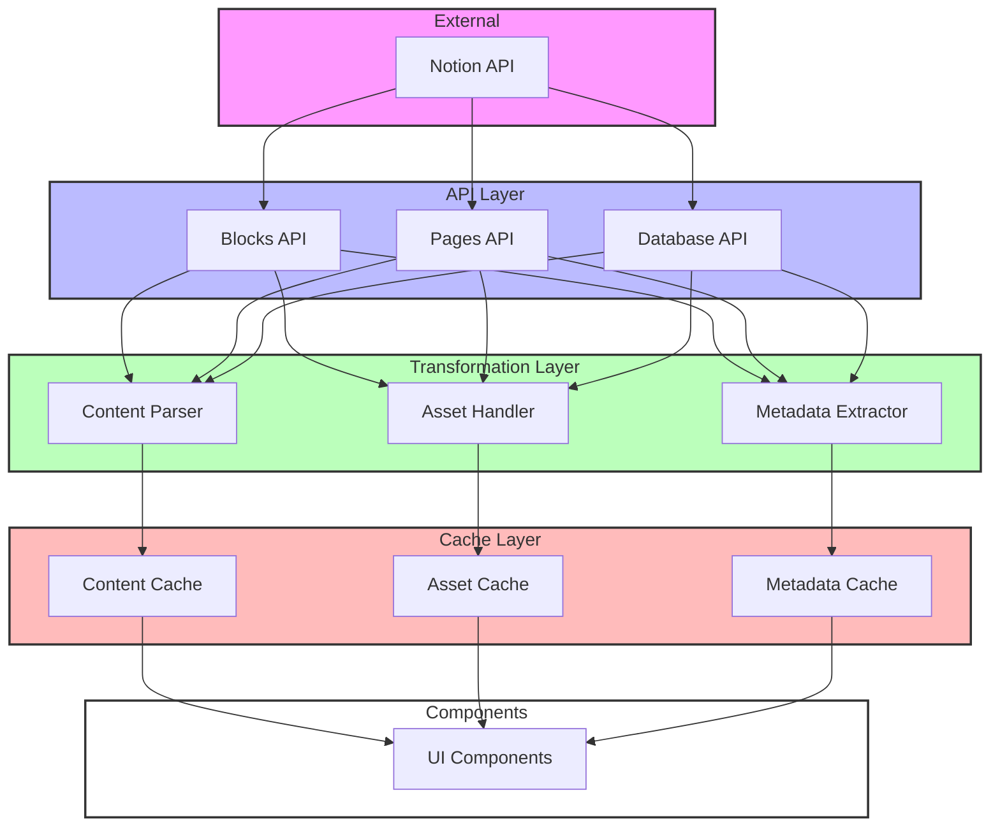
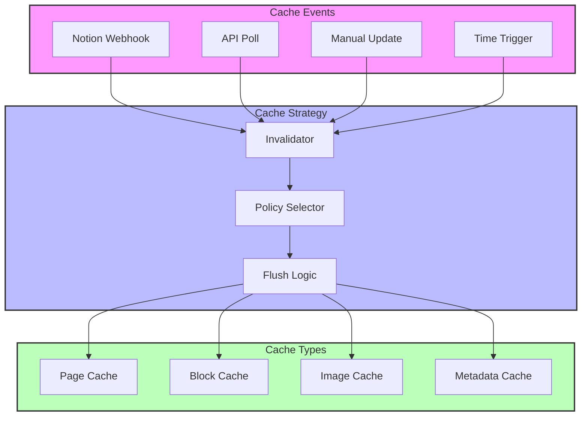
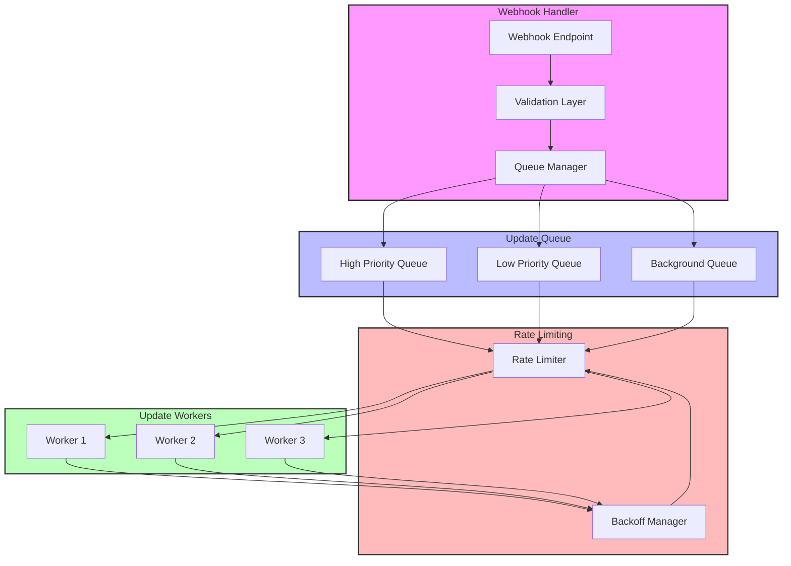

# Website Structure Diagram



## Directory Structure Details

### Root Structure
- `src/` - Main source code directory
  - `app.html` - Base HTML template
  - `app.css` - Global styles
  - `app.d.ts` - TypeScript declarations
  - `index.test.ts` - Test file

### Routes
- `routes/` - Page routing
  - `+layout.svelte` - Main layout component
  - `+page.svelte` - Main page component
  - `(landing-pages)/` - Landing page variations
  - `unsubscribe/` - Unsubscribe functionality

### Library
- `lib/` - Shared components and utilities
  - `stores.ts` - State management
  - `partials/` - Reusable partial components
    - `subpage-content.svelte` - Sub-page content wrapper
    - `form.svelte` - Form component
    - `load-scroll-trigger.ts` - Scroll trigger utility
  - `subpages/` - Sub-page components
  - `notion/` - Notion integration
    - `notion-page-parser.svelte` - Notion page rendering
    - `notion-image.svelte` - Notion image component
    - `notion-list-items.svelte` - Notion list rendering
    - `text-macro.svelte` - Text processing
    - `blog-helpers.ts` - Blog utility functions
    - `notion.ts` - Notion API integration
  - `homepage/` - Homepage specific components
    - `homepage-section.svelte` - Section component
    - `homepage-wrapper.svelte` - Layout wrapper
    - `site-title.svelte` - Site title component
  - `arcade/` - Arcade feature components
    - `shapes.ts` - Shape definitions and utilities
    - `input-handling.ts` - User input management
    - `notes.ts` - Game notes and documentation
  - `icons/` - Icon components

### Configuration Files
- `svelte.config.js` - Svelte configuration
- `vite.config.ts` - Vite build configuration
- `tsconfig.json` - TypeScript configuration
- `mdsvex.config.js` - MDSvex (Markdown) configuration
- `eslint.config.js` - ESLint configuration
- `.prettierrc` - Prettier configuration

## Notion Integration Details



### Notion Integration Components

#### 1. Core Integration (`notion.ts`)
- **Purpose**: Handles all Notion API interactions
- **Key Functions**:
  - `queryDatabase`: Lists and filters database contents
  - `listChildren`: Retrieves block children recursively
  - `retrieveBlock`: Gets single block content
  - `addCommission`: Creates commission entries
  - `addSubscriber`: Manages newsletter subscriptions
- **Dependencies**: @notionhq/client

#### 2. Page Parser (`notion-page-parser.svelte`)
- **Purpose**: Renders Notion blocks as HTML/Svelte components
- **Supported Blocks**:
  - Paragraphs
  - Headings (H2, H3)
  - Lists (Numbered and Bulleted)
  - Callouts
  - Quotes
  - Images
  - Code blocks
  - Dividers
- **Dependencies**: TextMacro, NotionImage, svelte-highlight

#### 3. Text Macro (`text-macro.svelte`)
- **Purpose**: Handles rich text rendering
- **Features**:
  - Text formatting
  - Link handling
  - Annotations processing
- **Used by**: NotionPageParser

#### 4. Image Component (`notion-image.svelte`)
- **Purpose**: Manages image rendering
- **Features**:
  - External image handling
  - File image processing
  - Callout image support
  - Alt text management

#### 5. Blog Helpers (`blog-helpers.ts`)
- **Purpose**: Content enhancement utilities
- **Functions**:
  - `subAndSuper`: Processes subscript/superscript
  - `wrapLists`: Structures list elements
  - `createTOC`: Generates table of contents

### Data Flow
1. NotionCore fetches data from Notion API
2. Data is passed to NotionPageParser
3. Parser delegates to specialized components:
   - Text content → TextMacro
   - Images → NotionImage
4. BlogHelpers enhance rendered content
5. Final HTML is rendered to the page

## Current Notion Integration

### Component Overview


### Current Components

#### 1. Core Integration (`notion.ts`)
- **Purpose**: Handles all Notion API interactions
- **Key Functions**:
  - `queryDatabase`: Lists and filters database contents
  - `listChildren`: Retrieves block children recursively
  - `retrieveBlock`: Gets single block content
  - `addCommission`: Creates commission entries
  - `addSubscriber`: Manages newsletter subscriptions
- **Dependencies**: @notionhq/client

#### 2. Page Parser (`notion-page-parser.svelte`)
- **Purpose**: Renders Notion blocks as HTML/Svelte components
- **Supported Blocks**:
  - Paragraphs
  - Headings (H2, H3)
  - Lists (Numbered and Bulleted)
  - Callouts
  - Quotes
  - Images
  - Code blocks
  - Dividers
- **Dependencies**: TextMacro, NotionImage, svelte-highlight

#### 3. Text Macro (`text-macro.svelte`)
- **Purpose**: Handles rich text rendering
- **Features**:
  - Text formatting
  - Link handling
  - Annotations processing
- **Used by**: NotionPageParser

#### 4. Image Component (`notion-image.svelte`)
- **Purpose**: Manages image rendering
- **Features**:
  - External image handling
  - File image processing
  - Callout image support
  - Alt text management

#### 5. Blog Helpers (`blog-helpers.ts`)
- **Purpose**: Content enhancement utilities
- **Functions**:
  - `subAndSuper`: Processes subscript/superscript
  - `wrapLists`: Structures list elements
  - `createTOC`: Generates table of contents

### Current Data Flow
1. NotionCore fetches data from Notion API
2. Data is passed to NotionPageParser
3. Parser delegates to specialized components:
   - Text content → TextMacro
   - Images → NotionImage
4. BlogHelpers enhance rendered content
5. Final HTML is rendered to the page

## Proposed Notion Integration Improvements

### 1. Revised Directory Structure

```
notion/
├── api/
│   ├── blocks.ts       # Block-specific operations
│   ├── pages.ts        # Page operations
│   ├── databases.ts    # Database operations
│   └── users.ts        # User operations
├── types/
│   ├── blocks.ts       # Block-related types
│   ├── pages.ts        # Page-related types
│   ├── common.ts       # Shared types
│   └── responses.ts    # API response types
├── components/
│   ├── blocks/         # Block-specific components
│   ├── text/          # Text rendering components
│   └── media/         # Media handling components
├── utils/
│   ├── validation.ts   # Parent-child validation
│   ├── rate-limit.ts   # Rate limiting logic
│   └── error.ts       # Error handling
└── config.ts          # API configuration
```

### 2. New Transformation Layer

```typescript
interface NotionTransformed {
  content: {
    markdown: string;
    html: string;  // Optional
    toc: TableOfContents;
  };
  metadata: {
    title: string;
    author?: string;
    date?: Date;
    tags?: string[];
    // Other page properties
  };
  assets: {
    images: ImageReference[];
    files: FileReference[];
  };
  relationships: {
    parentPage?: string;
    childPages?: string[];
    linkedPages?: string[];
  };
}
```

### 3. Key Improvements

#### API Organization
- Separate endpoints by object type (Blocks, Pages, Databases, Users)
- Implement proper versioning support
- Add dedicated error handling for different status codes

#### Content Transformation
- Convert blocks to markdown/HTML
- Maintain heading hierarchy
- Process code blocks with syntax highlighting
- Handle callouts and quotes consistently

#### Asset Management
- Improved image URL handling and caching
- File attachment processing
- Image optimization
- Better Notion CDN URL management

#### Type Safety
- Dedicated types for different Notion objects
- Better rich text handling
- Proper parent-child relationship typing

#### Performance
- Implement caching strategies
- Add rate limiting
- Handle request limits properly
- Batch process related content

### 4. New Data Flow Architecture



### 5. Cache Management Strategy



#### Cache Types and TTLs

1. **Page Cache**
   - TTL: 24 hours
   - Invalidation triggers:
     - Notion webhook for page updates
     - Manual content updates
     - Related page updates
   - Partial invalidation supported

2. **Block Cache**
   - TTL: 12 hours
   - Invalidation triggers:
     - Block content changes
     - Parent page updates
     - Dependent block updates
   - Granular block-level invalidation

3. **Image Cache**
   - TTL: 7 days
   - Invalidation triggers:
     - Image file changes
     - Manual image updates
     - CDN cache invalidation
   - Progressive loading support

4. **Metadata Cache**
   - TTL: 6 hours
   - Invalidation triggers:
     - Property changes
     - Relationship updates
     - Tag/category updates
   - Hierarchical invalidation

#### Invalidation Strategies

1. **Webhook-Based**
   ```typescript
   interface NotionWebhookPayload {
     type: 'page' | 'block' | 'image' | 'metadata';
     action: 'update' | 'delete' | 'create';
     id: string;
     relationships?: string[]; // Related items to invalidate
   }
   ```

2. **Time-Based**
   - Staggered TTLs to prevent cache stampede
   - Background refresh before expiration
   - Soft vs hard expiration times

3. **Dependency-Based**
   ```typescript
   interface CacheDependency {
     type: 'parent' | 'child' | 'sibling' | 'reference';
     ids: string[];
     cascading: boolean;
   }
   ```

4. **Manual Control**
   - Admin interface for cache management
   - Force refresh capabilities
   - Selective invalidation

#### Implementation Details

1. **Cache Keys**
   ```typescript
   type CacheKey = {
     type: 'page' | 'block' | 'image' | 'metadata';
     id: string;
     version: number;
     dependencies: CacheDependency[];
     lastUpdated: Date;
     ttl: number;
   };
   ```

2. **Cache Storage**
   - Redis for distributed caching
   - Local memory cache for frequent access
   - Filesystem cache for large assets

3. **Invalidation Logic**
   ```typescript
   interface InvalidationRule {
     pattern: RegExp | string;
     scope: 'single' | 'tree' | 'related';
     strategy: 'immediate' | 'lazy' | 'background';
     priority: number;
   }
   ```

4. **Performance Considerations**
   - Cache warming for critical paths
   - Preemptive invalidation
   - Rate limiting for cache rebuilds
   - Fallback mechanisms

#### Monitoring and Maintenance

1. **Cache Analytics**
   - Hit/miss ratios
   - Invalidation patterns
   - Storage utilization
   - Performance metrics

2. **Health Checks**
   - Cache consistency validation
   - Orphaned cache detection
   - Storage optimization
   - Performance bottleneck identification

3. **Maintenance Tasks**
   - Periodic full cache rebuild
   - Storage cleanup
   - Optimization routines
   - Backup procedures

### 6. Webhook-Driven Updates



#### Webhook Processing Strategy

1. **Priority Queues**
   ```typescript
   interface UpdateQueue {
     high: {
       maxRate: 3; // requests per second
       items: WebhookEvent[];
       types: ['page.essential', 'database.critical'];
     };
     low: {
       maxRate: 1; // request per second
       items: WebhookEvent[];
       types: ['page.content', 'block.update'];
     };
     background: {
       maxRate: 0.2; // 1 request per 5 seconds
       items: WebhookEvent[];
       types: ['metadata', 'relationship'];
     };
   }
   ```

2. **Smart Batching**
   ```typescript
   interface BatchStrategy {
     maxBatchSize: number;
     batchWindow: number; // ms
     mergeable: {
       blocks: boolean; // Can we combine block requests?
       pages: boolean;  // Can we combine page requests?
     };
     conditions: {
       parentId?: string;    // Same parent page
       database?: string;    // Same database
       updateType?: string;  // Same type of update
     };
   }
   ```

3. **Rate Limit Management**
   ```typescript
   interface RateLimitConfig {
     maxRequestsPerMinute: 180;  // Notion's limit
     maxRequestsPerHour: 1000;   // Notion's limit
     backoffStrategy: {
       initial: 1000;    // 1 second
       max: 300000;      // 5 minutes
       multiplier: 2;    // Exponential backoff
     };
     priorityOverrides: {
       critical: boolean;    // Bypass normal rate limiting
       maintenance: boolean; // Lower priority
     };
   }
   ```

#### Update Strategies

1. **Essential Updates** (High Priority)
   - Navigation structure changes
   - Critical content updates
   - User-triggered refreshes
   ```typescript
   const essentialStrategy = {
     maxRetries: 5,
     timeout: 10000,
     bypassCache: true,
     notifyFailure: true
   };
   ```

2. **Content Updates** (Low Priority)
   - Regular content changes
   - Non-critical updates
   - Background refreshes
   ```typescript
   const contentStrategy = {
     maxRetries: 3,
     timeout: 30000,
     batchable: true,
     bypassCache: false
   };
   ```

3. **Maintenance Updates** (Background)
   - Relationship updates
   - Metadata refreshes
   - Asset optimization
   ```typescript
   const maintenanceStrategy = {
     maxRetries: 1,
     timeout: 60000,
     batchable: true,
     deferrable: true
   };
   ```

#### Failure Handling

1. **Retry Strategies**
   ```typescript
   interface RetryStrategy {
     maxAttempts: number;
     backoffMs: number;
     strategy: 'exponential' | 'linear' | 'fixed';
     onFailure: {
       logError: boolean;
       notifyAdmin: boolean;
       fallbackToCache: boolean;
       markForReprocess: boolean;
     };
   }
   ```

2. **Fallback Mechanisms**
   - Serve stale cache on failure
   - Graceful degradation options
   - Alternative content sources

3. **Recovery Process**
   - Automated recovery attempts
   - Manual intervention triggers
   - Health check integration

#### Monitoring

1. **Webhook Health**
   - Webhook delivery success rate
   - Processing latency
   - Queue lengths
   - Rate limit headroom

2. **Update Success**
   - Update completion rate
   - Failed updates log
   - Retry statistics
   - Cache hit/miss rates during updates

### 7. Benefits

1. **Better Separation of Concerns**
   - Clear boundaries between API interaction and content transformation
   - Isolated component rendering logic
   - Dedicated asset handling

2. **Improved Developer Experience**
   - Type-safe content handling
   - Consistent API patterns
   - Better testing capabilities

3. **Enhanced Performance**
   - Strategic caching
   - Optimized asset loading
   - Batch processing capabilities

4. **Future-Proofing**
   - Easier to add new Notion features
   - Better scalability
   - More maintainable codebase

### 8. Implementation Priorities

1. Create new directory structure and move existing code
2. Implement transformation layer
3. Add proper typing system
4. Implement caching strategy
5. Enhance asset handling
6. Add performance optimizations
7. Improve error handling
8. Add comprehensive testing

This restructuring will provide a more robust, maintainable, and performant Notion integration while improving the developer experience and making future updates easier to implement. 