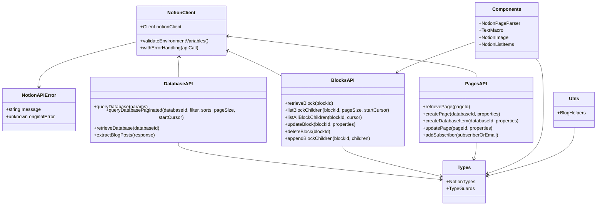

# Notion API Documentation

This document provides an overview of the Notion API integration structure used in this project.

## Overview

The Notion API integration is organized into several modules that handle different aspects of interacting with Notion's API:

- **Client**: Handles authentication and error handling for all API calls
- **Database**: Functions for querying and manipulating Notion databases
- **Blocks**: Functions for working with Notion blocks (content)
- **Pages**: Functions for creating and updating Notion pages
- **Types**: Type definitions for Notion API objects
- **Components**: Svelte components for rendering Notion content
- **Utils**: Helper functions for working with Notion data

## Architecture



## Modules

### Client (`api/client.ts`)

The client module provides the foundation for all Notion API interactions:

- `notionClient`: The Notion SDK client instance
- `validateEnvironmentVariables()`: Ensures all required environment variables are present
- `withErrorHandling()`: Wrapper function for API calls with standardized error handling
- `NotionAPIError`: Custom error class for Notion API errors

### Database (`api/database.ts`)

Functions for working with Notion databases:

- `queryDatabase(params)`: Query a Notion database with the provided parameters
- `queryDatabasePaginated(databaseId, filter, sorts, pageSize, startCursor)`: Query with pagination support
- `retrieveDatabase(databaseId)`: Retrieve database metadata
- `extractBlogPosts(response)`: Extract and format blog posts from a database query response

### Blocks (`api/blocks.ts`)

Functions for working with Notion blocks (content):

- `retrieveBlock(blockId)`: Retrieve a block by its ID
- `listBlockChildren(blockId, pageSize, startCursor)`: List children of a block with pagination
- `listAllBlockChildren(blockId, cursor)`: List all children recursively, including synced blocks
- `updateBlock(blockId, properties)`: Update a block's properties
- `deleteBlock(blockId)`: Delete a block
- `appendBlockChildren(blockId, children)`: Append children to a block

### Pages (`api/pages.ts`)

Functions for working with Notion pages:

- `retrievePage(pageId)`: Retrieve a page by its ID
- `createPage(databaseId, properties)`: Create a new page in a database
- `createDatabaseItem(databaseId, properties)`: Alias for createPage for backward compatibility
- `updatePage(pageId, properties)`: Update a page's properties
- `addSubscriber(subscriberOrEmail)`: Add a new subscriber to the subscribers database
  - Supports both object format: `addSubscriber({email})`
  - And string parameter: `addSubscriber(email)`

### Types (`types/notion-types.ts`, `types/guards.ts`)

Type definitions and type guards for Notion API objects:

- Notion API response types
- Custom types for application-specific data structures
- Type guard functions to safely work with Notion's polymorphic types

### Components (`components/`)

Svelte components for rendering Notion content:

- `NotionPageParser.svelte`: Renders a complete Notion page
- `TextMacro.svelte`: Renders rich text content
- `NotionImage.svelte`: Renders Notion images
- `NotionListItems.svelte`: Renders Notion list items

### Utils (`utils/blog-helpers.ts`)

Helper functions for working with Notion data:

- `subAndSuper()`: Process subscript and superscript in text
- `wrapLists()`: Process nested lists
- `createTOC()`: Create a table of contents from headings

## Usage Examples

### Querying a Database

```typescript
import { queryDatabase } from '$lib/notion/api/database';
import { BLOG_DB } from '$env/static/private';

const response = await queryDatabase({
	database_id: BLOG_DB,
	filter: {
		property: 'Published',
		checkbox: {
			equals: true
		}
	},
	sorts: [
		{
			property: 'Date',
			direction: 'descending'
		}
	]
});
```

### Retrieving Page Content

```typescript
import { retrievePage } from '$lib/notion/api/pages';
import { listAllBlockChildren } from '$lib/notion/api/blocks';

// Get page metadata
const page = await retrievePage(pageId);

// Get page content
const content = await listAllBlockChildren(pageId);
```

### Creating a New Page

```typescript
import { createPage } from '$lib/notion/api/pages';

const newPage = await createPage(databaseId, {
	Name: {
		title: [
			{
				text: {
					content: 'New Page Title'
				}
			}
		]
	},
	Status: {
		select: {
			name: 'Draft'
		}
	}
});
```

## Error Handling

All API functions use the `withErrorHandling` wrapper which provides consistent error handling:

```typescript
try {
	const result = await queryDatabase(params);
	// Process result
} catch (error) {
	if (error instanceof NotionAPIError) {
		// Handle specific error
		console.error(error.message);
	}
}
```

## Environment Variables

The following environment variables are used:

- `NOTION_KEY`: Notion API key (required)
- `BLOG_DB`: ID of the blog database
- `SUBSCRIBERS_DB`: ID of the subscribers database
- `USER_ID_ALICE`: User ID for Alice
